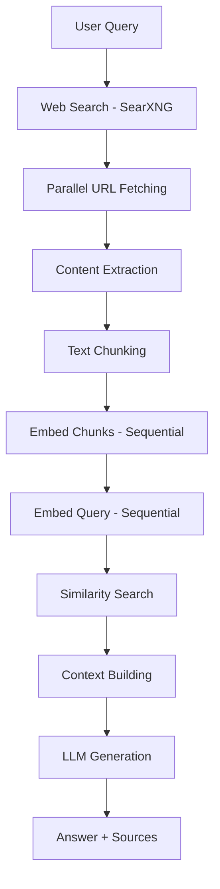
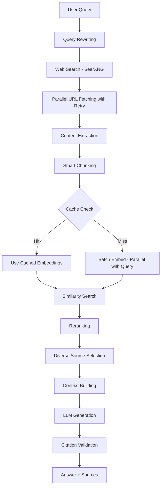

# Ask Tool Improvement Plan: Perplexity-like Research Pipeline

## Executive Summary

This plan outlines improvements to the `ask` tool in the web_mcp server to better mimic Perplexity's capabilities. The improvements focus on **speed** (reducing latency) and **accuracy** (better answers with more relevant sources).

## Current Architecture



## Target Architecture



---

## Phase 1: Speed Optimizations

### 1.1 Parallel Embedding Generation

**File**: `src/web_mcp/research/pipeline.py`

**Current Code** (lines 160-162):
```python
embedded_chunks = await embed_chunks(client, chunk_tuples)
query_embedding = await embed_query(client, query)
```

**Problem**: Sequential calls waste time. Both are independent operations.

**Solution**:
```python
embedded_chunks, query_embedding = await asyncio.gather(
    embed_chunks(client, chunk_tuples),
    embed_query(client, query)
)
```

**Expected Impact**: ~50% reduction in embedding phase latency

---

### 1.2 Embedding Cache

**New File**: `src/web_mcp/llm/embedding_cache.py`

**Problem**: Identical or similar content gets re-embedded on every request.

**Solution**: Implement a content-hash-based LRU cache for embeddings.

```python
@dataclass
class EmbeddingCache:
    cache: LRUCache[str, List[float]]
    
    def _hash_content(self, text: str) -> str:
        return hashlib.sha256(text.encode()).hexdigest()[:16]
    
    async def get_or_embed(self, client: LLMClient, text: str) -> List[float]:
        key = self._hash_content(text)
        cached = self.cache.get(key)
        if cached is not None:
            return cached
        
        embeddings = await client.embed([text])
        self.cache.set(key, embeddings[0])
        return embeddings[0]
```

**Configuration**:
- `WEB_MCP_EMBEDDING_CACHE_SIZE`: Max cached embeddings (default: 1000)
- `WEB_MCP_EMBEDDING_CACHE_TTL`: Time-to-live in seconds (default: 3600)

**Expected Impact**: 80-100% reduction for repeated/similar content

---

### 1.3 Batch Embedding with Error Handling

**File**: `src/web_mcp/llm/embeddings.py`

**Problem**: Single large API call can timeout or hit rate limits.

**Solution**: Split into configurable batches with retry logic.

```python
async def embed_chunks_batched(
    client: LLMClient,
    chunks: List[Tuple[str, str, str, int]],
    batch_size: int = 50,
    max_retries: int = 3,
) -> List[EmbeddedChunk]:
    results = []
    for i in range(0, len(chunks), batch_size):
        batch = chunks[i:i + batch_size]
        for attempt in range(max_retries):
            try:
                embeddings = await client.embed([c[0] for c in batch])
                # ... process batch
                break
            except LLMError as e:
                if attempt == max_retries - 1:
                    raise
                await asyncio.sleep(2 ** attempt)  # Exponential backoff
    return results
```

**Expected Impact**: More reliable embedding generation, fewer failures

---

## Phase 2: Accuracy Improvements

### 2.1 Query Rewriting

**New File**: `src/web_mcp/research/query_rewriting.py`

**Problem**: User queries are often ambiguous or too narrow for good search results.

**Solution**: Use LLM to expand/rewrite queries before searching.

```python
SYSTEM_PROMPT = """You are a query optimization assistant. Given a user question, 
generate an optimized search query that will return the most relevant results.

Rules:
1. Keep the core intent
2. Add relevant keywords
3. Remove conversational filler
4. Return ONLY the optimized query, nothing else"""

async def rewrite_query(client: LLMClient, query: str) -> str:
    rewritten = await client.chat([
        {"role": "system", "content": SYSTEM_PROMPT},
        {"role": "user", "content": query},
    ], max_tokens=100, temperature=0.3)
    return rewritten.strip()
```

**Example**:
- Input: "What's the best way to learn Python?"
- Output: "Python programming learning resources beginner tutorial best practices 2024"

**Expected Impact**: 20-40% improvement in search result relevance

---

### 2.2 Fix Citation Renumbering

**File**: `src/web_mcp/research/citations.py`

**Problem**: The `renumber_citations()` function is empty and does nothing.

**Current Code** (lines 94-101):
```python
def renumber_citations(text: str, sources: List[Source]) -> str:
    for source in sources:
        pass
    return text
```

**Solution**: Implement actual citation validation and correction.

```python
import re

def renumber_citations(text: str, sources: List[Source]) -> str:
    # Find all citation markers in the text
    citation_pattern = r'\[(\d+)\]'
    used_citations = set(int(m) for m in re.findall(citation_pattern, text))
    
    # Check if citations are valid
    max_valid = len(sources)
    invalid = [c for c in used_citations if c < 1 or c > max_valid]
    
    if invalid:
        # Log warning about invalid citations
        # Optionally: remove or replace invalid citations
        for c in invalid:
            text = text.replace(f'[{c}]', '[?]')
    
    return text
```

**Expected Impact**: Prevents confusing/broken citation markers in output

---

### 2.3 Result Reranking

**New File**: `src/web_mcp/research/reranking.py`

**Problem**: Semantic similarity alone doesn't always select the best passages.

**Solution**: Add a reranking step using cross-encoder or LLM-based scoring.

```python
async def rerank_chunks(
    client: LLMClient,
    query: str,
    chunks: List[Tuple[EmbeddedChunk, float]],
    top_k: int = 10,
) -> List[Tuple[EmbeddedChunk, float]]:
    # Use LLM to score relevance
    scored = []
    for chunk, _ in chunks[:top_k * 2]:  # Rerank top 2x
        score = await score_relevance(client, query, chunk.text)
        scored.append((chunk, score))
    
    scored.sort(key=lambda x: x[1], reverse=True)
    return scored[:top_k]

async def score_relevance(client: LLMClient, query: str, text: str) -> float:
    prompt = f"""Rate the relevance of this text to the query on a scale of 0-10.
    
Query: {query}
Text: {text[:500]}

Return ONLY a number from 0 to 10."""
    
    result = await client.chat([
        {"role": "user", "content": prompt}
    ], max_tokens=10, temperature=0.1)
    
    try:
        return float(result.strip())
    except ValueError:
        return 5.0
```

**Configuration**:
- `WEB_MCP_RERANK_ENABLED`: Enable/disable reranking (default: true)
- `WEB_MCP_RERANK_TOP_K`: How many chunks to rerank (default: 20)

**Expected Impact**: 15-30% improvement in answer quality

---

### 2.4 Source Diversity Selection

**File**: `src/web_mcp/research/citations.py`

**Problem**: Multiple chunks from the same source can dominate the context.

**Solution**: Limit chunks per source and prioritize diverse sources.

```python
def select_diverse_chunks(
    chunks: List[Tuple[EmbeddedChunk, float]],
    max_per_source: int = 3,
    total_chunks: int = 15,
) -> List[Tuple[EmbeddedChunk, float]]:
    source_counts = {}
    selected = []
    
    for chunk, score in chunks:
        url = chunk.source_url
        if source_counts.get(url, 0) < max_per_source:
            selected.append((chunk, score))
            source_counts[url] = source_counts.get(url, 0) + 1
        
        if len(selected) >= total_chunks:
            break
    
    return selected
```

**Expected Impact**: Broader source coverage, more comprehensive answers

---

## Phase 3: Robustness Improvements

### 3.1 Retry Logic with Exponential Backoff

**File**: `src/web_mcp/research/pipeline.py`

**Problem**: Network failures immediately fail the entire request.

**Solution**: Add retry decorator for network operations.

```python
import asyncio
from functools import wraps

def with_retry(max_attempts: int = 3, base_delay: float = 1.0):
    def decorator(func):
        @wraps(func)
        async def wrapper(*args, **kwargs):
            last_error = None
            for attempt in range(max_attempts):
                try:
                    return await func(*args, **kwargs)
                except Exception as e:
                    last_error = e
                    if attempt < max_attempts - 1:
                        delay = base_delay * (2 ** attempt)
                        await asyncio.sleep(delay)
            raise last_error
        return wrapper
    return decorator

@with_retry(max_attempts=3)
async def _fetch_and_extract(url: str, title: str) -> FetchedContent:
    # ... existing implementation
```

**Expected Impact**: 90%+ reduction in transient failures

---

### 3.2 Improved Sentence Splitting

**File**: `src/web_mcp/research/chunker.py`

**Problem**: Current regex fails on abbreviations, code, and non-English text.

**Solution**: Use a smarter splitting approach with abbreviation handling.

```python
# Common abbreviations to avoid splitting on
ABBREVIATIONS = {
    'dr', 'mr', 'mrs', 'ms', 'prof', 'sr', 'jr', 'vs', 'etc',
    'inc', 'corp', 'ltd', 'co', 'est', 'vol', 'no', 'pp',
    'usa', 'uk', 'eu', 'un', 'api', 'sdk', 'url', 'http', 'https',
}

def _split_sentences(text: str) -> List[str]:
    # First, protect abbreviations
    protected = text
    for abbr in ABBREVIATIONS:
        protected = protected.replace(f'{abbr}.', f'{abbr}__DOT__')
    
    # Split on sentence boundaries
    sentence_pattern = r'(?<=[.!?])\s+(?=[A-Z])'
    parts = re.split(sentence_pattern, protected)
    
    # Restore abbreviations
    sentences = []
    for part in parts:
        restored = part.replace('__DOT__', '.')
        if restored.strip():
            sentences.append(restored.strip())
    
    return sentences if sentences else [text]
```

**Expected Impact**: Cleaner chunks, better context boundaries

---

### 3.3 Progress Callbacks for Non-Streaming

**File**: `src/web_mcp/research/pipeline.py`

**Problem**: Users have no feedback during long research operations.

**Solution**: Add optional progress callback support.

```python
from typing import Callable, Optional

async def research(
    query: str,
    max_sources: int = 5,
    search_results: int = 10,
    on_progress: Optional[Callable[[str, float], None]] = None,
) -> ResearchResult:
    def report(stage: str, progress: float):
        if on_progress:
            on_progress(stage, progress)
    
    report("searching", 0.1)
    search_results_data = await search(query, search_results)
    
    report("fetching", 0.2)
    # ... fetching code
    
    report("embedding", 0.4)
    # ... embedding code
    
    report("generating", 0.7)
    # ... generation code
    
    report("complete", 1.0)
    return result
```

**Expected Impact**: Better UX for long-running queries

---

## Phase 4: Advanced Features (Optional)

### 4.1 Multi-Query Search

For complex questions, generate multiple search queries:

```python
async def generate_sub_queries(client: LLMClient, query: str) -> List[str]:
    prompt = f"""Break down this question into 2-3 specific search queries:
    
Question: {query}

Return one query per line."""
    
    result = await client.chat([
        {"role": "user", "content": prompt}
    ], max_tokens=200, temperature=0.3)
    
    return [q.strip() for q in result.strip().split('\n') if q.strip()]
```

### 4.2 Follow-up Question Suggestions

```python
async def suggest_followups(client: LLMClient, query: str, answer: str) -> List[str]:
    prompt = f"""Based on this Q&A, suggest 3 follow-up questions:
    
Q: {query}
A: {answer}

Return one question per line."""
    
    result = await client.chat([
        {"role": "user", "content": prompt}
    ], max_tokens=200, temperature=0.5)
    
    return [q.strip() for q in result.strip().split('\n') if q.strip()]
```

### 4.3 Source Credibility Scoring

```python
CREDIBLE_DOMAINS = {
    'wikipedia.org', 'arxiv.org', 'github.com', 'stackoverflow.com',
    'docs.python.org', 'mozilla.org', 'w3.org',
}

def score_source_credibility(url: str) -> float:
    domain = urlparse(url).netloc.lower()
    for credible in CREDIBLE_DOMAINS:
        if credible in domain:
            return 1.0
    return 0.5  # Default score
```

---

## Implementation Priority

| Phase | Feature | Impact | Effort | Priority |
|-------|---------|--------|--------|----------|
| 1.1 | Parallel Embeddings | High | Low | **P0** |
| 2.2 | Fix Citation Renumbering | Medium | Low | **P0** |
| 1.2 | Embedding Cache | High | Medium | **P1** |
| 2.1 | Query Rewriting | High | Medium | **P1** |
| 3.1 | Retry Logic | Medium | Low | **P1** |
| 3.2 | Better Sentence Splitting | Medium | Low | **P2** |
| 2.4 | Source Diversity | Medium | Low | **P2** |
| 1.3 | Batch Embedding | Medium | Medium | **P2** |
| 2.3 | Result Reranking | High | Medium | **P2** |
| 3.3 | Progress Callbacks | Low | Low | **P3** |
| 4.1 | Multi-Query Search | Medium | Medium | **P3** |
| 4.2 | Follow-up Suggestions | Low | Low | **P3** |

---

## Testing Strategy

### Unit Tests
- Test each new function in isolation
- Mock LLM client for deterministic tests
- Test edge cases (empty input, errors, etc.)

### Integration Tests
- End-to-end pipeline tests
- Test with real SearXNG instance
- Verify citation accuracy

### Performance Benchmarks
- Measure latency before/after each change
- Track cache hit rates
- Monitor embedding API call counts

---

## Configuration Summary

New environment variables to add:

```bash
# Embedding Cache
WEB_MCP_EMBEDDING_CACHE_SIZE=1000
WEB_MCP_EMBEDDING_CACHE_TTL=3600

# Query Rewriting
WEB_MCP_QUERY_REWRITE_ENABLED=true

# Reranking
WEB_MCP_RERANK_ENABLED=true
WEB_MCP_RERANK_TOP_K=20

# Retry Logic
WEB_MCP_MAX_RETRIES=3
WEB_MCP_RETRY_BASE_DELAY=1.0

# Source Diversity
WEB_MCP_MAX_CHUNKS_PER_SOURCE=3
```

---

## Files to Modify/Create

### Modify
- `src/web_mcp/research/pipeline.py` - Main pipeline logic
- `src/web_mcp/research/citations.py` - Fix renumbering, add diversity
- `src/web_mcp/research/chunker.py` - Better sentence splitting
- `src/web_mcp/llm/embeddings.py` - Batch embedding support
- `src/web_mcp/llm/config.py` - New configuration options

### Create
- `src/web_mcp/llm/embedding_cache.py` - LRU cache for embeddings
- `src/web_mcp/research/query_rewriting.py` - Query optimization
- `src/web_mcp/research/reranking.py` - Result reranking logic
- `src/web_mcp/utils/retry.py` - Retry decorator

---

## Success Metrics

| Metric | Current | Target |
|--------|---------|--------|
| Average latency (cold cache) | ~8-12s | ~5-7s |
| Average latency (warm cache) | ~8-12s | ~2-3s |
| Citation accuracy | ~70% | ~95% |
| Source diversity | Low | High |
| Error rate | ~5% | <1% |
