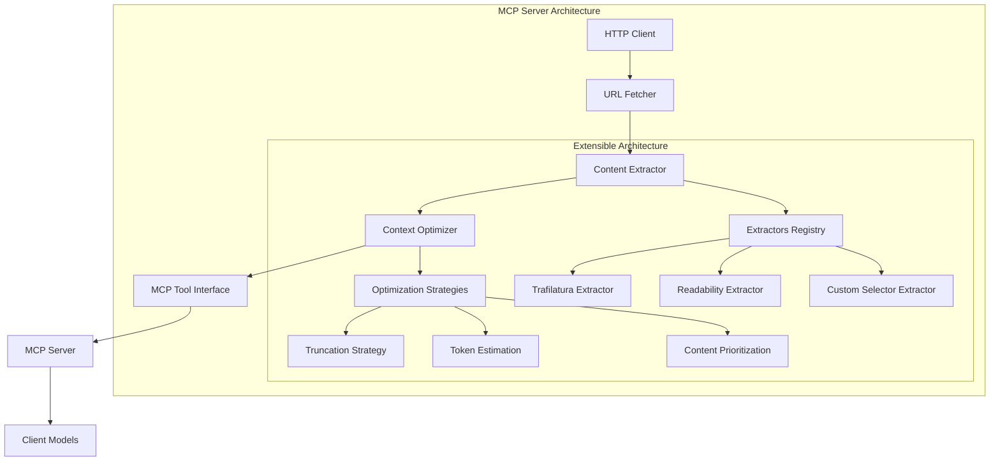

# Web Browsing MCP Server - Design Document

## Overview
This document outlines the design for an MCP (Model Context Protocol) server that enables models to browse the web efficiently while being mindful of context size limitations.

## Architecture

### High-Level Design


### Component Breakdown

#### 1. Core Server (`src/web_mcp/server.py`)
- Main MCP server instance
- Tool registration and routing
- Configuration management

#### 2. URL Fetcher (`src/web_mcp/fetcher.py`)
- HTTP request handling
- Timeout management
- User agent rotation
- Error handling

#### 3. Content Extractors (`src/web_mcp/extractors/`)
- **TrafilaturaExtractor** - Primary extractor using Trafilatura library
- **ReadabilityExtractor** - Alternative for article-focused content
- **CustomSelectorExtractor** - For specific site patterns

#### 4. Context Optimizer (`src/web_mcp/optimizer.py`)
- Token estimation
- Content truncation
- Smart content prioritization

#### 5. Configuration (`src/web_mcp/config.py`)
- Default settings
- Per-request overrides
- Environment-based configuration

## Key Features

### 1. Extensible Extractor Architecture
```python
class ContentExtractor(ABC):
    @abstractmethod
    def extract(self, html: str, url: str) -> ExtractedContent:
        pass

class TrafilaturaExtractor(ContentExtractor):
    def extract(self, html: str, url: str) -> ExtractedContent:
        # Uses trafilatura.extract()
        pass
```

### 2. Context Optimization Strategies

#### Token Estimation
- Estimate tokens from text (roughly 1 token = 4 characters)
- Track estimated token count
- Truncate if exceeds limit

#### Smart Truncation
- Keep first N words of main content
- Preserve structure (headings, paragraphs)
- Remove low-value content

#### Content Prioritization
- Extract metadata (title, author, date)
- Extract main content
- Optionally extract comments
- Optionally extract links

### 3. Configuration Options

```python
{
    "default_max_tokens": 4096,
    "extractors": {
        "primary": "trafilatura",
        "fallback": ["readability", "custom"]
    },
    "extraction_options": {
        "include_comments": false,
        "include_links": false,
        "include_metadata": true
    },
    "optimization": {
        "token_estimation": true,
        "truncation_strategy": "smart",
        "preserve_structure": true
    }
}
```

## Implementation Plan

### Phase 1: Core Server Setup
- Initialize Python project with `uv`
- Set up MCP server with Trafilatura
- Create basic tool for URL fetching

### Phase 2: Extractor Implementation
- Implement Trafilatura extractor
- Add fallback extractors
- Create extractor registry

### Phase 3: Context Optimization
- Implement token estimation
- Add truncation logic
- Create optimization strategies

### Phase 4: Configuration System
- Create config module
- Add environment variable support
- Implement per-request overrides

### Phase 5: Documentation & Testing
- Create usage documentation
- Add tests for each component

## Project Structure

```
web_mcp/
├── src/
│   └── web_mcp/
│       ├── __init__.py
│       ├── server.py          # Main MCP server
│       ├── config.py          # Configuration management
│       ├── fetcher.py         # URL fetching
│       ├── optimizer.py       # Context optimization
│       └── extractors/
│           ├── __init__.py
│           ├── base.py        # Base extractor interface
│           ├── trafilatura.py # Trafilatura implementation
│           ├── readability.py # Readability implementation
│           └── custom.py      # Custom selector implementation
├── tests/
│   ├── test_fetcher.py
│   ├── test_extractors.py
│   └── test_optimizer.py
├── pyproject.toml
└── README.md
```

## Key Design Decisions

### 1. Why Trafilatura?
- Best-in-class extraction accuracy
- Actively maintained
- Good performance
- Supports metadata extraction

### 2. Extensible Architecture
- Allows adding new extractors without changing core code
- Fallback mechanism for reliability
- Easy to test individual components

### 3. Context Optimization
- Token estimation prevents context overflow
- Smart truncation preserves content quality
- Configurable limits per request

### 4. Environment Configuration
- `WEB_MCP_CONTEXT_LIMIT` - Default context limit (120k tokens)
- Configurable per-request via tool parameters
- Graceful degradation when limit exceeded

### 5. MCP Protocol Compliance
- Uses `@mcp.tool()` decorator
- Returns structured output with Pydantic models
- Proper error handling

## Configuration Example

```python
# .env file
MCP_SERVER_PORT=3000
WEB_MCP_CONTEXT_LIMIT=120000  # Default context limit (120k tokens)
REQUEST_TIMEOUT=30

# Per-request configuration
{
    "url": "https://example.com",
    "max_tokens": 2048,
    "include_metadata": true,
    "extractor": "trafilatura"
}
```

## Next Steps

1. Create project structure
2. Implement core server with Trafilatura
3. Add context optimization
4. Test with various websites
5. Document usage
